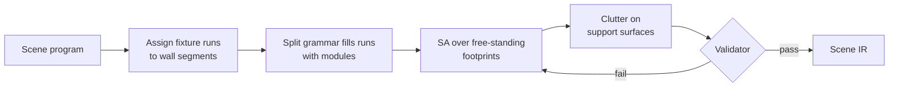
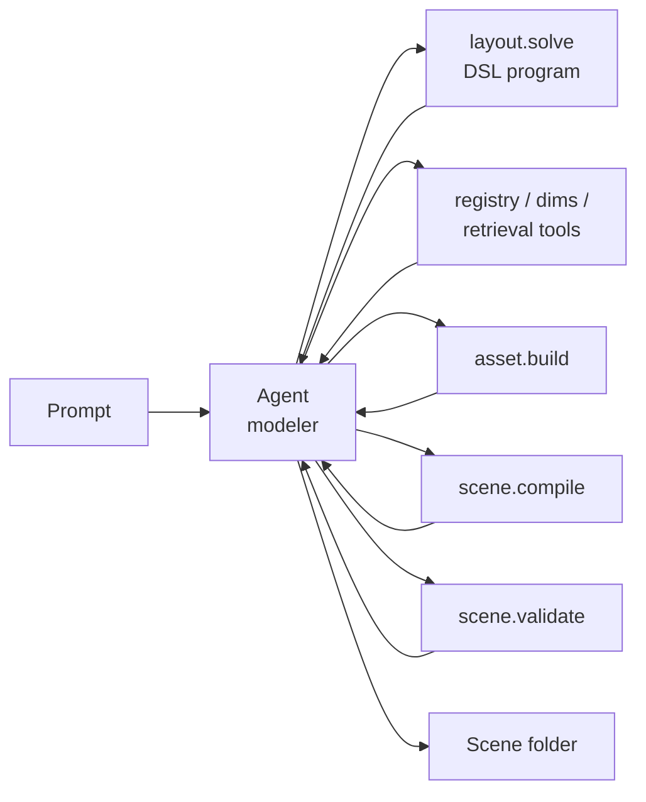

# Text-to-Scene Generation System: Core Plan

2026-09-16 · @u_LYweu6308DfErXx86q_U5w

## Implementation addendum

The accepted implementation decisions and milestone status are maintained in
[pipeline-implementation.md](pipeline-implementation.md). They supersede open
choices below: kitchen-first; explicit engineering defaults allowed; G1 plus
native G3/uniform scaling; G2 supervised offline and G4 deferred pending part
segmentation/anchors; Cycles only (no diffusion); URDF/PyBullet before USD.
The implemented compiler uses native MuJoCo `MjSpec`, not `dm_control.mjcf`.
Required unknown categories fail instead of being silently dropped. The current
candidate-based layout and sampled geometric sweep are initial implementations,
not claims that annealing, robot connectivity or dynamic endpoint gates are done.
The original design below remains useful as the target, not implementation status.

## What's actually unsolved

Every requirement in the spec is solved somewhere in prior work, but never together, and the composition hides one missing piece: a metric asset vocabulary that extends itself from an open prompt.

| System | Prompt-conditioned | Metric guarantee | Physics-ready articulation | Where it fails the spec |
| --- | --- | --- | --- | --- |
| Infinigen Indoors | No | Yes (procedural, constraint solver) | Partial, Blender-native | \~79 hand-written residential generators; hours per scene; exports geometry, not sim joints |
| RoboCasa | No | Yes (hand-curated) | Yes, MuJoCo | Dataset, not generator: 10 fixed floor plans, 2,509 vetted assets |
| Holodeck / RoboGen / LayoutGPT | Yes | No | Limited / retrieval | LLM near the numbers; Objaverse at arbitrary scale |
| PhyScene / ATISS / DiffuScene | Partial | Yes (learned from 3D-FRONT) | No | Residential prior; emits poses, not sim scenes |
| Articulate-Anything / URDFormer | Yes | No | Yes, object-level | Objects only, no scene |

The vocabulary problem: prompts are open-vocabulary, but every system with a metric guarantee has a closed, hand-curated asset library. "A dental clinic with a sterilization station" has no Infinigen generator and no RoboCasa asset. The systems that can take that prompt fall back to generative 3D or LLM dimensions, which is exactly where the metric guarantee dies.

The missing piece is the middle: a library that grows under a metric guarantee. Source dimensions from real data, pick a parameterization, produce a physics-valid asset, verify it in the simulator, cache it. Two smaller gaps sit beside it: almost nobody derives mass and inertia from material density, and prior work evaluates with FID or user studies rather than "does it load and stay stable." The spec's rubric is the validator nobody built.

## Design principles

A coding agent takes the place of the human modeler and drives deterministic tools; no number from the model's memory reaches the simulator. The agent chooses categories, writes the constraint program, sources dimensions from fetched pages and picks parameterizations; every dimension, mass and coordinate is produced by a tool from real data.

- Constrain during generation, check after. Standards and clearances are solver constraints; a separate validator confirms the compiled scene and reports back to the agent.
- Parametric first, retrieval second, generative last. Templates give exact dimensions and articulation for free; retrieved assets are rescaled to known dimensions; generated meshes are healed to metric scale and used as dressing.
- A missing object beats a wrong dimension. When no reliable dimension exists, the object is flagged and dropped.
- One scene IR, many emitters. MJCF, Blender and USD all read the same file; nothing is authored twice.
- Deterministic tools, seeded. The agent's trajectory may vary between runs; every tool it calls is reproducible and cached by input hash.
- Robustness over coverage. Two geometry routes that always work beat six that sometimes do; the rest are added after the prototypes in the design-options doc.

## Scene IR: the single contract

A versioned JSON schema is the only artifact every stage reads and writes. It carries enough to compile physics, render, export and answer ground-truth queries, so the simulation and the render are one scene by construction.

| Section | Fields | Notes |
| --- | --- | --- |
| `meta` | schema version, prompt, seed, area target (m²), units = metres, Z-up, origin | Origin fixed at the main entrance threshold |
| `rooms[]` | id, polygon (m), ceiling height, role (main, walk-in, store) | Simple polygons only in v1 |
| `openings[]` | id, room pair or exterior, wall index, offset, clear width, height, type (door, pass-through), swing side and angle | Doors are articulated fixtures that reference an opening |
| `objects[]` | instance id, category, semantic class, source (parametric / retrieved / generated), dimensions (w, d, h), pose, static or dynamic, material, density, mass, articulation spec, support parent | One entry per rigid body root |
| `articulation` | per object: joints (type, axis, range, damping, armature), child part geometry, swept footprint | Swept footprint is what the solver reserves |
| `zones[]` | id, label, polygon | From the LLM program; used for relations and semantic navigation later |
| `provenance` | per object: dimension source, asset source, resolver route, validator result | Makes every number auditable |

The IR stores dimensions and poses, never geometry. Meshes live in a content-addressed asset cache keyed by category and parameter hash; the IR references them by key.

## Stage 1: scene program in a constraint DSL

The agent writes the scene program as code in a small Python-embedded constraint DSL. It carries categories, counts, zones, relations, groups and per-zone density targets; it carries no dimensions and no coordinates.

What a program contains:

- `space(type, area_m2=None)` and `zone(label, role, weight)`
- `place(category, count, zone=None, static=None, articulated=None)`
- Relations: `against_wall(a)`, `adjacent(a, b)`, `facing(a, b)`, `in_zone(a, z)`, `front_clearance(a)`, `near_opening(a)`, `in_row(a, b, c)`, `under(a, b)`
- `density(zone, objects_per_m2)` and `style(tags)`

Every constraint is soft except those the standards table marks hard, and each returns a named object so `layout.solve` can report exactly which constraint failed. When the solver returns an unsatisfiable set, the agent revises the program; the solver never relaxes a dimension. Programs are cached by prompt hash so the same prompt yields the same program on the held-out run.

Categories the registry does not know stay in the program; the resolver in Stage 2 is where the agent decides whether to match, build or drop them.

## Stage 2: asset library and resolver

The resolver is the agent working a set of tools to turn a category name into a physics-valid, metrically sized asset, extending the library when it has to. This is the core of the system and where the metric guarantee lives.

**Tool surface.** `registry.search(name)` returns candidate categories with aliases, template and dimension distribution; `dims.lookup(category)` reads the offline table and dataset statistics; `dims.fetch(query)` fetches pages and accepts an extraction only if its quote appears verbatim in the page; `asset.build(route, params)` produces the asset and runs the object validator; `retrieval.search(category)` queries PartNet-Mobility and ShapeNetSem. The agent never computes geometry itself.

**Category registry.** Each entry holds: geometry route, dimension distribution, material and density class, articulation spec, semantic class, aliases, provenance. The dimension distribution is a Gaussian on log-dimensions (w, d, h) fitted from ShapeNetSem, ABO and 3D-FUTURE instances and clamped to the standards table, so sampled sizes stay correlated.

**Category matching.** The agent calls `registry.search` and judges whether a hit is the same thing ("lowboy" in a kitchen is an undercounter fridge). No embedding threshold or separate matcher; if false matches appear, the fix is richer aliases.

**Geometry routes in v1** (design-options doc, D7):

| Route | Covers | How dimensions and joints are set |
| --- | --- | --- |
| G1 fixed templates | Base and wall cabinets, drawer units, fridges, walk-ins, ovens, dishwashers, doors, shelving, prep tables | Box-composition: carcass split along width into modules at 300 / 450 / 600 / 900 mm; module types door-L, door-R, n-drawers, open shelf; hinge on the free edge, slide along depth; primitives for collision |
| G3 retrieval + rescale | Non-box articulated objects (valves, faucets, microwaves) from PartNet-Mobility; clutter from ShapeNetSem and a curated set | Mesh bbox scaled to sampled (w, d, h), CoACD per part, URDF joints translated to MJCF |
| G6/G8 generated + healed | Dressing with no library match, via fal | Canonical orientation, watertight repair, anisotropic rescale to sampled dims, CoACD; articulation from segmentation only if the P6 prototype is adopted |

Agent-authored generators (G2) and part-aware rescale (G4) replace G1 and G3 for their categories if prototypes P4 and P5 favour them.

**Template assignment.** The agent reads the route descriptions and the retrieval results and picks: retrieval if a rigged or sized match exists, a template if the object fits one, generated-and-healed for dressing, drop otherwise. `asset.build` rejects parameters outside a route's declared domain, which is the guard against forcing a valve into the cabinet template.

**Dimension sourcing.** Resolution order: offline table, dataset statistics, web via `dims.fetch`, drop. Web extraction is the agent's job; the verbatim-quote check is the tool's. No further trust policy in v1; the agent cross-checks when a value looks off. Every accepted dimension is written back to the table with its source, so the web is touched once per category and the held-out run stays offline for known ones.

**Library growth.** A newly built asset enters the cache only after passing the object validator (compiles, settles, joints sweep cleanly). The cache is content-addressed by route and parameter hash.

## Stage 3: floor plan

`floorplan.build(space)` is a tool with defaults the agent can override from the DSL; v1 covers the spec's 30–120 m² working spaces with a rectangle or L-shape main room plus zero to two annex rooms split off by a single axis-aligned cut.

| Parameter | Default | Overridable from DSL |
| --- | --- | --- |
| Main room aspect ratio | Sampled 1.2–2.0 | Yes, `space(aspect=...)` |
| Annex rooms (walk-in, dry store, office) | 8–20% of area each, attached to a wall without fixture runs | Yes, `annex(role, share)` |
| Openings | One exterior entrance, one door per annex, clear width ≥ 813 mm (ADA), swing recorded in the IR | Placement yes; minimum width no (hard) |
| Ceiling height | 2.7–3.2 m for commercial spaces (standards table) | Within the standards range only |

Grammar-based multi-room plans and floor-plan dataset statistics (CubiCasa5K, 3D-FRONT) are deferred; they replace this tool's internals without touching the IR or the DSL.

## Stage 4: layout solver

Three stages, each deterministic given the seed. Fixtures are placed by rule, free-standing objects by simulated annealing over 2D footprints, clutter by rejection sampling on support surfaces.

`layout.solve` returns either a layout or the named set of constraints it could not satisfy. The agent decides the response: re-run with a different seed, revise the program (drop a relation, reduce a count, move an object to another zone), or swap an asset for a smaller variant. Dimensions are never relaxed.

**Stage A, fixture runs.** The DSL says which runs go on which walls (`run("prep", wall="longest_free")`, `run("wash", near=drain)`); the solver only assigns segments and lets the box template's split grammar fill each run with modules at standard widths, so counter height and module widths are exact by construction. No zone-role heuristics live in the solver: what a prep line or a wash station needs is the agent's knowledge, written per prompt.

**Stage B, free-standing objects.** Simulated annealing over (x, y, yaw) per object.

| Constraint | Type | Source |
| --- | --- | --- |
| No overlap, including each object's articulation swept footprint | Hard | Asset spec |
| Work aisle ≥ 1,067 mm (one worker) or 1,219 mm (multiple) | Hard | NKBA |
| Walkway ≥ 914 mm | Hard | NKBA |
| Clear floor space 762 × 1,219 mm in front of appliances | Hard | ADA / ANSI A117.1 |
| Door swing clearance | Hard | IR openings |
| Connectivity: every zone reachable from the entrance by a disc of robot radius + margin | Hard | Robot spec |
| LLM relations: adjacent, facing, in\_zone, near\_opening | Soft | Scene program |
| Wall alignment and orthogonality | Soft | Heuristic |
| Layout statistics: footprint coverage, wall-adjacency fraction, objects per m² | Soft | Fitted from 3D-FRONT / CubiCasa5K |

The statistics term is the CropCraft-style idea: match distribution-level properties of real layouts rather than any specific one. It is where the post-hoc blueprint check lives, as a cost the solver can act on rather than a rejection.

**Stage C, clutter.** Small objects are sampled on the top faces recorded as support surfaces, rejected on overlap or overhang, and assigned `dynamic`. Density targets come from the program's zone roles.

## Stage 5: physics compiler to MJCF

The compiler is a pure function from Scene IR to an MJCF tree built with `dm_control.mjcf`, so every physical property is traceable to an IR field.

| Concern | Rule |
| --- | --- |
| Visual vs collision | Visual mesh geoms in a `visual` class with `contype=0 conaffinity=0`; collision geoms in a `collision` class |
| Collision shape | Primitives (box, cylinder) for template assets; CoACD convex hulls for retrieved and generated meshes, capped at 16 hulls per part |
| Mass and inertia | Density per material class; mass = density × collision volume per part; hollow classes (cabinets, fridges, ovens) use a shell density so a 600 mm base cabinet lands at 25–40 kg, not 200 kg; `inertiafromgeom` on collision geoms only |
| Static vs dynamic | Fixtures and architecture are static bodies; clutter and articulated children are dynamic |
| Joints | Type, axis, range from the articulation spec; `damping`, `armature`, `frictionloss` from category defaults; limited ranges always on |
| Contact filtering | `contact/exclude` between each articulated parent and child; walls and floor in one collision group |
| Semantics | Body names `<class>__<instance_id>__<part>`; a sidecar manifest maps instance id → class, IR entry, body ids, joint ids |
| Compiler and solver | `integrator=implicitfast`, `timestep=0.002`, `cone=elliptic`, `noslip_iterations=0`, `autolimits=true`, `angle=radian`, `meshdir` relative to the scene folder |

World frame: metres, Z-up, origin at the entrance threshold on the floor, X pointing into the room. Every emitted MJCF compiles without warnings; a warning is treated as a validator failure.

## Stage 6: validator

The validator runs on every compiled scene and every new asset, and its report is the definition of done. It is the spec's grading rubric turned into code.

| Check | Method | Pass threshold |
| --- | --- | --- |
| Compiles | `mujoco.MjModel.from_xml_path` | No errors, no warnings |
| Settles | Step 5 s of sim from rest | Max body drift < 5 mm, max joint drift < 0.5° |
| No interpenetration at rest | Read contacts after settle | No contact with penetration depth > 2 mm |
| Articulation sweep | Drive every joint through its full range at low speed | No new contacts beyond parent–child excludes; joint reaches both limits |
| Metric assertions | Read poses and geometry from the model | Counter tops 850–950 mm; door clear width ≥ 813 mm; masses within category bounds |
| Connectivity | Rasterize static geometry to a 5 cm occupancy grid; flood-fill with robot radius | Every zone centroid reachable from the entrance |
| Semantics | Query every instance id through the manifest | Class, pose, bbox and joint state returned for all objects |

The report goes back to the agent with a reason code per failure, and the agent chooses the fix: re-solve, revise the program, swap an asset, or drop an object and record why. The harness caps agent iterations per scene (20 in v1) and fails the run with the last report if the cap is hit. The report is written next to the scene as `validation.json` and is part of the deliverable.

## Orchestration and reproducibility

The pipeline ships as an agent skill for a coding agent (Claude Code or Codex). The agent holds the loop; every box below except the agent is a seeded, deterministic tool.

- Two entry points: `generate(prompt, seed)` runs the agent to a validated scene folder; `variants(scene, n)` writes n seeded variants without the agent, for domain randomization later.
- Every tool writes its output to the scene folder (`program.py`, `ir.json`, `scene.xml`, `manifest.json`, `validation.json`, `cost.json`, `trajectory.jsonl`), so any stage can be re-run in isolation and the agent's decisions are auditable.
- Tool calls are cached by input hash: programs by prompt, fetches by URL, assets by route and parameters. The held-out run touches the network only for unseen categories.
- Harness limits in v1: 20 agent iterations per scene, then fail with the last validator report. Stronger guarantees (transcript replay, a no-agent fallback path) are deferred until a problem appears.
- `cost.json` records wall clock, tokens and API spend per tool for the marginal-cost table.

## Deferred components and how they slot in

Each deferred piece attaches through an existing seam, so none requires changing the IR.

| Component | Attaches as |
| --- | --- |
| Blender Cycles render | Implemented bridge from the shared compiled scene; diffusion is out of scope |
| USD / URDF export | New emitter |
| Robots, sensors, flows | Consumers of `scene.xml` + `manifest.json`; spawn points from zones and the connectivity grid |
| Agent-authored generators (G2) | New `asset.build` route with a sandboxed generator skeleton; adopted per P4 |
| Part-aware rescale (G4) | Replaces uniform rescale inside the retrieval route; adopted per P5 |
| Articulated healing of generated meshes (G8) | Segmentation and joint-authoring step inside the generated route; adopted per P6 |
| Inverse-procedural fit (G5) | Route that estimates template parameters from a generated reference image |
| Grammar floor plans, CubiCasa / 3D-FRONT statistics | Replace Stage 3; extend the solver's statistics term |
| Learned layout priors (ATISS, DiffuScene) | Additional soft cost or proposal distribution in Stage 4 |
| Domain randomization | Seeded perturbations of materials, lighting and clutter in `variants()` |
| Dimension trust policy, formal dimension DB | Harness rules and a database behind the same `dims.*` tools |
| Harness hardening | Transcript replay, no-agent fallback path, tighter iteration budgets |

## Open questions to pressure-test before building

Still open:

- [ ] Is the box-composition template (G1) expressive enough for the first three prompts we would actually run? Write one prompt per space type and list every articulated object it implies.
- [ ] P5: uniform vs part-aware rescale for retrieved articulated objects. Run first; it also exercises the URDF→MJCF path.
- [ ] P4: fixed templates vs agent-authored generators for non-box articulated categories.
- [ ] Does `layout.solve` need a 3D clearance check for tall objects, or is the validator's sweep enough? This is now an efficiency question: without it the agent burns iterations on wall-cabinet collisions the solver could have avoided.
- [ ] What DSL primitives beyond the listed relations do the first prompts need? Keep the vocabulary as small as those prompts allow.
- [ ] Drop vs grey-box fallback when no dimension can be sourced (see the comment on Design principles).

Resolved by the agent architecture:

- Door placement. Stage order no longer decides it. Openings are IR entries with a `pinned` flag: the DSL can pin a door (`opening(wall="north", offset=2.0)`) or leave it free, and `layout.solve` treats a free opening's offset as a variable alongside fixture runs, subject to the hard width and swing constraints. If the joint solve fails, the agent pins or moves the door and re-runs. Ownership is the solver's; sequencing is the agent's.
- Minimum viable offline dimension table. Seed it with whatever the first three prompts need and let `dims.fetch` grow it. There is no target size; the table is a cache with provenance.
- Connectivity and open articulation. `layout.solve` checks robot connectivity on closed-state footprints plus the aisle constraints; the swept-footprint no-overlap constraint already guarantees every joint can reach full range. Navigating past an open drawer is a flow-time concern, not a layout one.
