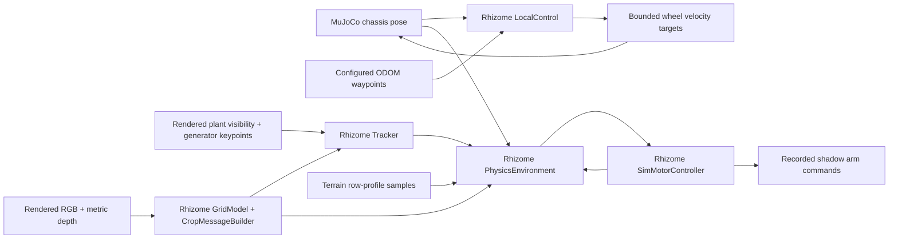

# Rhizome software in MuJoCo

Alamin can run Rhizome's compiled `LocalControlNode` against the simulated
robot's pose. Four native `TrackerNode` instances consume either neural RGB/depth
predictions or explicitly selected visible-plant oracle detections. An optional native `PhysicsEnvironment` and `SimMotorController`
produce provisional arm commands. These are imports from the Rhizome checkout,
not reimplementations of its algorithms.

This stage connects local waypoint following and the downstream weeding path.
Route scheduling, `drive_mux`, the hardware `drive_control`
and `arm_control` nodes are not running. The original Inicio robot has no physical
arms. The [Gen 3 importer](gen3.md) adds four articulated arms and lets one native
planner use MuJoCo joint feedback via `controller.physical_arm`. Both models
retain visual-only plants, so neither removes weeds or measures crop damage.



## Run

Use Python 3.12, Alamin's `pipeline` extra and the new `rhizome` extra. Rhizome
must have matching host bindings under `build/host/py/pyzome`: `core`, `nav`,
`node_test`, and, for weeding, `tracker` and `physics`. Build them in Rhizome
using its host build workflow if missing. No daemon, ROS, cloud account or live
robot connection is needed.

For the current weeding integration, build an isolated set of all five modules:

```bash
.venv/bin/python -m scene_pipeline.rhizome_build --root ../rhizome \
  --output outputs/rhizome_host_current --jobs 4
export RHIZOME_HOST_BUILD="$PWD/outputs/rhizome_host_current/host"
```

Choose a fresh output directory when rebuilding. This avoids stale dependency
files and object archives. The build manifest records the source fingerprint and
module hashes; the worker verifies these before loading the modules. A change to
compiled sources requires a rebuild. `controller.host_build` overrides the
environment variable; both select the directory containing `py/pyzome`.
Older bindings without separate row/foliage geometry are rejected for weeding.
The September 9 binaries caused the [oracle cross-row barrier bug](soybean30_oracle_diagnosis.md).

```bash
uv sync --extra pipeline --extra rhizome --extra dev

MUJOCO_GL=egl .venv/bin/pipeline run outputs/raptor30_field \
  --flow agriculture-drive --config examples/agriculture/rhizome.json \
  --output outputs/rhizome_run --timeout 120

.venv/bin/pipeline inspect outputs/rhizome_run --no-open
```

Use a new output directory for every run. The supplied config assumes the field
example's spawn at `[-2, 0]` and sets a goal at `[0, 0]`. To run navigation without
rendering, set `controller.perception` to `"none"`, remove `shadow_arm`, and use
`--tier state --no-video`. Visible-plant perception requires full camera capture.

`controller.root` selects the Rhizome checkout and expands `~`. Optional
`controller.python` selects a separate interpreter for the perception
environments. It must match the bindings' ABI and have PyYAML. Alamin does not
change the sibling repo or install its node/service configuration globally.

## Neural perception

`examples/agriculture/soybean30_neural_rows.json` selects the geometry upgrade of
`/data/models/edge_packages/multicrop_td_wzmle4cf_grid` with soybean conditioning.
Build the upgraded package as described below before running this config.
It uses the existing `../ml-aigen-tools/venv312` interpreter, which has PyTorch,
NumPy, OpenCV and PyYAML, plus the selected Rhizome checkout's host bindings and
Python sources. Set `controller.python` if using another compatible environment.
Alamin's main interpreter does not need PyTorch.

```bash
MUJOCO_GL=egl .venv/bin/pipeline run outputs/soybean30_early_gen3 \
  --flow agriculture-drive --config examples/agriculture/soybean30_neural_rows.json \
  --output outputs/soybean30_early_neural_rows --timeout 1800
```

The example explicitly runs TorchScript on CPU. `neural.device: "cuda"` requests
CUDA and fails if unavailable; it never silently falls back to CPU or oracle
detections. On the development machine MuJoCo EGL works, but the existing
PyTorch environment currently reports a CUDA initialization error. CPU inference
works and is slower than simulation time.
Use `MUJOCO_GL=osmesa` when EGL is unavailable; software rendering plus four
CPU inference streams can take more than five minutes for a 12-second rollout.

The adapter uses Rhizome's `GridModel`, `ModelPipeline` and `CropMessageBuilder`.
Each camera owns separate model/postprocessor history. It passes only RGB, metric
depth, calibration and capture-time poses into inference. It does not pass
instance masks, plant classes/locations or terrain samples. Predictions include
keypoints, ground-row profiles and density metrics; the selected camera's
predicted row profile and densities feed the shadow planner. Empty or failing
predictions never trigger an oracle/terrain fallback.

The package was exported with 480×832 neural input after a 16-pixel left crop.
The adapter resizes captured RGB/depth to 848×480, scales intrinsics accordingly,
and lets Rhizome apply its crop and normalization. RGB uses bilinear resizing;
depth uses nearest-neighbor. Metres become uint16 sensor units at 0.1 mm per unit,
with zero for invalid or unrepresentable depths. The package's `depth_norm: 10200`
remains authoritative. Inputs remain ideal rendered depth, without D405 noise.

MuJoCo camera axes are converted to the optical right/down/forward convention.
Grid forward receives camera→ODOM and ODOM→target transforms with 3-vector
translations. For legacy shadow arms, `neural.target_positions_chassis_m` lists
each provisional target frame; optional `target_quaternions_chassis_wxyz` supplies
its orientation (identity by default). The selected camera's target must match
the arm mount. Gen 3 physical-arm mode resolves both from the robot profile,
including the rearward ARM frame. Model outputs carry their actual target frame
through Rhizome's native tracker into ODOM. Optical mounts still need calibration.

The adapter accepts grid packages publishing in `arm` frame. Native weeding
requires geometry ABI v1 (`odom`, `geometry_`); predicted rows and foliage pass
through the tracker into the arm planner. Their capture timestamps stay on the
simulation clock so slow rendering/inference cannot make fresh geometry stale.
`crop_species` must appear in the package's conditioning layout.

The original supplied package predates this geometry contract. Repackage its
unchanged trained core with the current ml-aigen-tools postprocessor:

```bash
../ml-aigen-tools/venv312/bin/python examples/agriculture/upgrade_grid_geometry.py \
  --tools-root ../ml-aigen-tools \
  --package /data/models/edge_packages/multicrop_td_wzmle4cf_grid \
  --output outputs/multicrop_td_wzmle4cf_grid_geometry
```

The output directory must be fresh. The script verifies exact core state-tensor
equality, copies the numerical reference, and records package hashes/provenance.
It uses this package's canonical ten segmentation classes. Postprocessing changes,
including geometry and barrier/obstruction classes, mean the resulting neural
run is not identical to the historical neural baseline. Select the output with
`controller.neural.package`; the original package remains untouched. The ready
configs `soybean30_oracle_rows.json` and `soybean30_neural_rows.json` select the
new host build and, for neural, the upgraded package. Older example configs need
the same package override when using an arm planner.

## Configuration

Choose either a `controller` block or the original timed `commands`. Waypoints
use world XY in metres, identical to ODOM in this adapter. Each waypoint has
`xy`, optional `direction` (`FORWARD` or `REVERSE`), and optional `type` (`NORMAL`,
`TURN`, or `ARMS_UP`). `ARMS_UP` is waypoint metadata only in this stage; the
upstream arm orchestration node is absent.

The native controller selects its pursuit goal from this list. Supported
`parameters` are `auto_speed_max_ms`, `turn_speed`, `max_turn_rate`,
`lookahead_distance`, `arrival_distance` and `kp`. The default speed is 0.25 m/s.
Speed boosting is disabled because its weed-presence watchdog pipeline is not
connected. Wheel kinematics continue using the exported RAPTOR_30 dimensions.

`perception: "oracle_visible"` uses rendered instance masks to select plants,
then uses generator-provided ground positions and crop/weed labels. It assigns a
fixed 2 cm keypoint/box size. These are intentionally optimistic synthetic
detections, not outputs from RGB/depth inference. Occluded plants with no visible
pixels are excluded. Native tracking still performs association and promotion.

The optional `shadow_arm` explicitly selects a camera and a
`position_chassis_m`. Its axes are chassis-aligned. Its tube, tool and joint
extents come from Rhizome's `test/data/physics/arm_1.yml` and
`src/base_control/arms.yml`; planner settings come from `physics_0.node.yml`.
The example mount is provisional. Only this camera's tracks feed this arm;
the other cameras' tracked outputs are recorded separately. Multi-arm collision
coordination and calibrated payload mounting are not represented.

## Timing, frames and isolation

MuJoCo advances at 500 Hz. The worker receives pose/velocity at 100 Hz, runs
`LocalControl` at 10 Hz, steps the weeding environment/motor model at 100 Hz,
and receives camera detections at 10 Hz. Commands hold between controller ticks.
All physics steps wait for their corresponding controller response; capture
can run slower than real time. Each rollout starts a fresh subprocess with an
in-process native test bus, isolating globals and tracker IDs between runs.

MuJoCo gives the chassis pose in world coordinates. Rhizome's `/frames/odom`
requires the inverse: ODOM expressed in ROBOT. The adapter performs this inversion
and preserves full quaternion orientation. Planner detections are tracked ODOM
points. Terrain is ray-sampled and expressed in the provisional arm frame.

HDF5 and the JSONL envelope use simulation seconds. Native camera timestamps use
simulation seconds plus one second, avoiding zero's "unset" meaning. Native
message headers retain Rhizome's host clock. The adapter applies the registry's
configured detection timeout using simulation seconds and its native removal API,
disables local-goal expiry, and refreshes the latest row profile every planner tick, following the existing offline replay approach. This is not a
general simulated-clock implementation for arbitrary Rhizome nodes or watchdogs.

A missing/failed native worker or expired response deadline stops the rollout,
zeros actuator commands and produces a failed, inspectable report. It never
falls back to timed commands. The process is terminated and reaped on exit.

## Evidence and inspection

In addition to the normal agricultural artifacts, each run contains:

- `rhizome/provenance.json`: checkout revision, independent native-library hashes,
  source-config hashes, resolved local-control settings and scope limitations.
  A checkout revision alone does not establish which sources built a local `.so`.
- `rhizome/conf/`: node configuration snapshots used by the isolated worker.
- `rhizome/shadow_arm_config.json`: provisional arm/tool/planner inputs, when enabled.
- `rhizome/messages.jsonl`: timestamped inputs, drive commands, raw/tracked
  detections, planner target IDs/states and arm commands/feedback.
- `rhizome/worker.log`: native/Python diagnostics.
- HDF5 `rhizome_raptor_30_*` streams: input/tracked counts at 10 Hz, labeled by perception mode.
- HDF5 `rhizome_shadow_arm`: commanded and software-measured `[yaw, pitch]`
  radians, target ID and detection count at 100 Hz.

For neural runs, camera summary streams contain `neural_detection_count`,
`tracked_detection_count`, `row_profile_count` and `inference_wall_seconds`.
`rhizome/provenance.json` includes the package config, used model-file hashes,
runtime/device, conditioning, input size, depth units and target frames.
JSONL `infer` results retain raw predictions, tracked messages, predicted profiles,
densities and scaled intrinsics. The request's `frame_file` is a temporary transport
file removed after the synchronous reply; permanent inputs are in the camera HDF5
streams at the envelope's simulation timestamp.

`raptor_30_*_neural.png` overlays raw predicted keypoints on each camera's final
RGB frame (green crop, magenta other classes). These views appear in the inspection
page. The overlays and masks allow qualitative comparison; they do not establish
precision/recall or field performance. `oracle_detections` remains zero in neural
runs; raw and tracked counts count observations across frames, not unique plants.

The report separates physical rollout completion, final waypoint distance and
`goal_reached`. A passing physics run does not prove navigation success or weed
removal. `physical_weeding` is explicitly false. SEARCHING is a valid recorded
planner state; use target IDs and state transitions to confirm actual engagement.

```bash
RHIZOME_ROOT=../rhizome MUJOCO_GL=osmesa .venv/bin/python -m pytest \
  tests/test_rhizome.py tests/test_agriculture.py -q
```

Tests exercise native forward/reverse/stop commands, a closed-loop MuJoCo goal,
stable native tracks, weed selection and pitch-down, plus worker-death handling.
Native checks skip when the optional checkout/build is unavailable; they do not
substitute mock controllers.

`tests/test_rhizome_perception.py` additionally checks optical/target transforms,
the supplied core against `reference.npz`, sensor depth conversion, scaled
intrinsics, real four-camera neural capture without oracle access, and model-load
failure handling. Optional environment overrides are `RHIZOME_MODEL` and
`RHIZOME_INFERENCE_PYTHON`; these tests skip if those dependencies are absent.

## Next connections

Neural perception is connected. Remaining perception work includes matching
payload calibration and camera effects, checking accuracy against scene labels,
and supporting newer foliage-geometry packages when needed.

The physical arm step needs payload mesh/articulation, mount transforms, yaw and
pitch axes/limits, masses/inertias and tool/contact geometry. Then the measured
arm input can come from MuJoCo instead of `SimMotorController`, and commands can
drive articulated joints. Keep the native Box2D planner: it is controller logic,
not a replacement for MuJoCo's physical arm and soil/contact simulation.

Multiple Gen 3 payloads can run through independent native planners using
`controller.physical_arms`; see [the four-arm setup and acceptance workflow](weeding.md#four-arm-native-planning).
